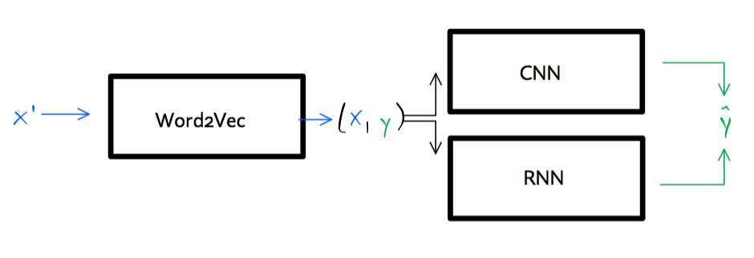

```{r setup, include=FALSE}
knitr::opts_chunk$set(echo = FALSE, message = FALSE, warning = FALSE)
library(kableExtra)
library(data.table)
```

# neuralNets

A small project on the use of deep learning for natural language processing (NLP).

## Prerequisites

Implementation of deep learning is done through TensorFlow. To install TensorFlow 2 see [here](https://www.tensorflow.org/install/).

## NLP with deep learning

The [notebook](notebook.ipynb) trains various deep learning models to a simple, binary text classification problem. The [data set](data/data.txt) contains restaurant reviews which are labelled as either positive ($=1$) or negative ($=0$):

```{r}
kable(head(fread("data/data.txt")), col.names = c("Review", "Label"))
```

Below you may find a high-level overview of the motivation, methodology and results. All code along with comments is contained in the [notebook](notebook.ipynb) which is divided into the following sections:

1. Load and preprocess data 
2. A first run
3. Model selection through hyperparameter tuning
4. Final predictions

### Methodology

Both a convolutional neural network (CNN) and several recurrent neural networks (RNN) are trained to word-wise and and character-wise classification of the labels. Both deep learning approaches rely on an unsupervised neural language model at the first stage, which learns the word vectors  -- essentially a representation of the text in vector form. The whole process can be summarized broadly as follows: a corpus of text $\mathbf{X}^{'}$ is fed to a `word2vec` model. The output $\mathbf{X}$ and corresponding vector of target labels $\mathbf{y}$ is then fed to a supervised deep learning model, which produces the final predictions $\mathbf{\hat{y}}$.



For model selection through hyperparameter tuning a simple grid search framework is built from scratch.^[Alternatively, one can perform grid search through existing libraries, for example, `sklearn` or `ray`. The latter was tested, but I ran into issues. The low-level custom grid search ultimately worked very well.]

#### Embeddings

With respect to the word embeddings three different approaches are used: *random* -- words are randomly initialized, *non-static* -- embeddings are pre-trained through `word2vec` and fine-tuned during training, and *GloVe* -- pre-trained global word vectors are used. The latter are obtained from [GloVe](https://nlp.stanford.edu/projects/glove/). In particular, the 50-$d$ Wikipedia 2014 + Gigaword 5 vectors are used here. 

#### CNN

Convolutional neural networks were originally invented in the context of computer vision, but have subsequently been successfully applied to NLP. CNNs involve layers of filters that convolve over a tensor of input features -- in the animation below this is illustrated as the green filter sliding over the blue matrix of inputs^[Animation of convoluting filter in action. Source: [towards data science](https://towardsdatascience.com/applied-deep-learning-part-4-convolutional-neural-networks-584bc134c1e2)]. In the underlying case of text classification the filters convolve over the padding sequences contained in $\mathbf{X}$ and produce a tensor of features (red matrix in the animation below) which is then fed to the subsequent dense layers of the main sequential model. Finally a sigmoid layer produces a probability distribution over labels.


#### RNN

Recurrent neural networks are based on the idea of persistent thoughts: thinking is modelled as a continuous process that instead of continuously reinventing itself and starting from scratch, evolves gradually and at each step uses information about its prior states. This hierarchical, chain-like nature of RNNs makes them particularly useful for problems that involves sequences, for example, speech recognition or time series analysis. The former is the focus of this small project, so let us dwell on this a little further. Consider the sentence fragment, which is lifted directly from the [data set](data/data.txt) we treat in this project: "[...] will not meet your expectations." Without further context, if you had to classify the sentiment of this text fragment, you would probably label it as negative. When the full sequence of words is revealed the label switches to positive: "Great Subway, in fact it's so good when you come here every other Subway will not meet your expectations." This demonstrates the importance of using prior information that emerges from the context. The sentence also demonstrates that it can be difficult to learn the *context* of a single word just from its nearest neighbours: to understand the role of the word "expectations" in the context of this sentence, it is not enough to look at a few words preceding it. In fact, as we saw above, too small a choice of the context window may lead to wrong conclusions about the sentiment label. In order to account for long-term dependencies we can use a Long Short Term Memory (LSTM) network, a special kind of RNN.

## Results

The best CNN and RNN classifiers have been serialized and saved to disk (`cnn.json` and `rnn.json`, respectively). To load and use a model and its corresponding weights, you can simply run the below from within the root folder of this repository:

```{r, echo=FALSE}
library(reticulate)
```

```{python, echo=TRUE, eval=FALSE}
# load json and create model
json_file = open('cnn.json', 'r')
loaded_model_json = json_file.read()
json_file.close()
loaded_model = model_from_json(loaded_model_json)
# load weights into new model
loaded_model.load_weights("cnn.h5")
```

Both models ended up with roughly the same overall accuracy, both reaching perfect in-sample accuracy after only 2-3 epochs and an average validation accuracy of >80% over the first 10 epochs. 

In terms of hyper parameter tuning and model architecture the following observations can be made: 

- **CNN**: the best model in terms of validation accuracy used 2 filter sizes, 100 filters and just 1 hidden layer of 150 neurons. In terms of word embeddings, best performance was achieved using GloVe. 

- **RNN**: the best model turns out to be a Gated Recurrent Unit (GRU). GRUs are very similar to LSTMs and generally have been found to yield similar performance when applied to NLP. For small data sets, as we have here, GRUs often outperform LSTMs. The optimal number of hidden neurons identified by the grid search is 100. Contrary to the results for the CNN above, we find that in this case the randomly initialized word vectors outperform the pre-trained GloVe vectors.

```{r}
dt_pred <- fread("predictions.csv")[,V1:=NULL]
cor_models <- cor(dt_pred$pred_cnn, dt_pred$pred_rnn)
```

Since independently of each other both the CNN and RNN produce perfect in-sample predictions of the discrete labels, it is not surprising that the correlation between their respective probabilistic predictions is `r round(cor_models,2)*100` percent. The figure below illustrates this further. It plots the twenty most frequent words occurring in sentences that were labelled as either positive (=1) or negative (=0) by the CNN and RNN, respectively^[Stop words have been removed.]. Evidently there are certain similarities: both models appear to have learned that negative reviews tend revolve around timing and positive reviews tend to be packed with positive attributes describing either staff, food or the atmosphere.

```{r clouds, fig.width=10, fig.height=5}
library(ggwordcloud)
library(tidytext)
library(dplyr)
stop_words <- tidytext::stop_words
stop_words <- rbind(
  data.table(stop_words),
  data.table(word=c("food", "service", "restaurant")), 
  fill=TRUE
)
dt_plot <- dt_pred %>%
    tidytext::unnest_tokens(word, sentence) %>%
    dplyr::anti_join(stop_words)
dt_plot <- melt(
  dt_plot, 
  id.vars = c("word", "true"), 
  measure.vars = c("pred_cnn", "pred_rnn"), 
  value.name = "sentiment",
  variable.name = "model"
)
dt_plot <- unique(dt_plot[,.(.N, sentiment=mean(sentiment)), by=.(word, true, model)])
setorder(dt_plot, true, model, -N)
dt_plot <- dt_plot[,idx:=1:.N,by=.(true,model)][idx<=20][,idx:=NULL]
levels(dt_plot$model) <- c("CNN", "RNN")
dt_plot[,sentiment:=factor(round(sentiment))]
ggplot(dt_plot, ggplot2::aes(label = word, size = N, colour=sentiment)) +
  geom_text_wordcloud() +
  scale_size_area(max_size = 5) +
  scale_colour_manual(
    guide=FALSE,
    values = c("coral", "darkgreen")
  ) +
  facet_grid(
    cols = vars(model),
    rows = vars(sentiment)
  )
```

# Notes

