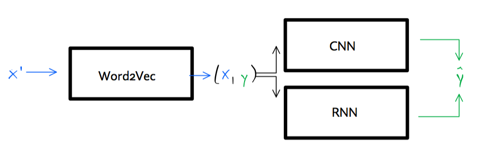
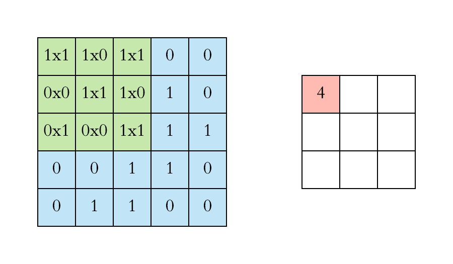

# neuralNets

A small project on the use of deep learning for natural language
processing (NLP).

## Prerequisites

Implementation of deep learning is done through TensorFlow. To install
TensorFlow 2 see [here](https://www.tensorflow.org/install/).

## NLP with deep learning

The [notebook](notebook.ipynb) trains various deep learning models to a
simple, binary text classification problem. The [data
set](data/data.txt) contains restaurant reviews which are labelled as
either positive ( = 1) or negative ( = 0):

<table>
<thead>
<tr>
<th style="text-align:left;">
Review
</th>
<th style="text-align:right;">
Label
</th>
</tr>
</thead>
<tbody>
<tr>
<td style="text-align:left;">
Wow… Loved this place.
</td>
<td style="text-align:right;">
1
</td>
</tr>
<tr>
<td style="text-align:left;">
Crust is not good.
</td>
<td style="text-align:right;">
0
</td>
</tr>
<tr>
<td style="text-align:left;">
Not tasty and the texture was just nasty.
</td>
<td style="text-align:right;">
0
</td>
</tr>
<tr>
<td style="text-align:left;">
Stopped by during the late May bank holiday off Rick Steve
recommendation and loved it.
</td>
<td style="text-align:right;">
1
</td>
</tr>
<tr>
<td style="text-align:left;">
The selection on the menu was great and so were the prices.
</td>
<td style="text-align:right;">
1
</td>
</tr>
<tr>
<td style="text-align:left;">
Now I am getting angry and I want my damn pho.
</td>
<td style="text-align:right;">
0
</td>
</tr>
</tbody>
</table>

Below you may find a high-level overview of the methodology and results.
Code and detailed comments are contained in the
[notebook](notebook.ipynb) which is divided into the following sections:

1.  Load and preprocess data
2.  A first run
3.  Model selection through hyperparameter tuning
4.  Final predictions

### Methodology

Both a convolutional neural network (CNN) and several recurrent neural
networks (RNN) are trained to word-wise and and character-wise
classification of the labels. Both deep learning approaches rely on an
unsupervised neural language model at the first stage, which learns the
word vectors – essentially a representation of the text in vector form.
The whole process can be summarized broadly as follows: a corpus of text
**X̄** is fed to a `word2vec` model. The output **X** and corresponding
vector of target labels **y** is then fed to a supervised deep learning
model, which produces the final predictions **ŷ**.

For model selection through hyperparameter tuning a simple grid search
framework is built from scratch.[1]

#### Embeddings

With respect to the word embeddings three different approaches are used:
*random* – words are randomly initialized, *non-static* – embeddings are
pre-trained through `word2vec` and fine-tuned during training, and
*GloVe* – pre-trained global word vectors are used. The latter are
obtained from [GloVe](https://nlp.stanford.edu/projects/glove/). In
particular, the 50-*d* Wikipedia 2014 + Gigaword 5 vectors are used
here.

#### CNN

Convolutional neural networks were originally invented in the context of
computer vision, but have subsequently been successfully applied to NLP.
CNNs involve layers of filters that convolve over a tensor of input
features – in the animation below this is illustrated as the green
filter sliding over the blue matrix of inputs[2]. In the underlying case
of text classification the filters convolve over the padding sequences
contained in **X** and produce a tensor of features (red matrix in the
animation below) which is then fed to the subsequent dense layers of the
main sequential model. Finally a sigmoid layer produces a probability
distribution over labels.

#### RNN

Recurrent neural networks are based on the idea of persistent thoughts:
thinking is modelled as a continuous process that instead of
continuously reinventing itself and starting from scratch, evolves
gradually and at each step uses information about its prior states. This
hierarchical, chain-like nature of RNNs makes them particularly useful
for problems that involves sequences, for example, speech recognition or
time series analysis. The former is the focus of this small project, so
let us dwell on this a little further. Consider the sentence fragment,
which is lifted directly from the [data set](data/data.txt) we treat in
this project: “\[…\] will not meet your expectations.” Without further
context, if you had to classify the sentiment of this text fragment, you
would probably label it as negative. When the full sequence of words is
revealed the label switches to positive: “Great Subway, in fact it’s so
good when you come here every other Subway will not meet your
expectations.” This demonstrates the importance of using prior
information that emerges from the context. The sentence also
demonstrates that it can be difficult to learn the *context* of a single
word just from its nearest neighbours: to understand the role of the
word “expectations” in the context of this sentence, it is not enough to
look at a few words preceding it. In fact, as we saw above, too small a
choice of the context window may lead to wrong conclusions about the
sentiment label. In order to account for long-term dependencies we can
use a Long Short Term Memory (LSTM) network, a special kind of RNN.

## Results

The best CNN and RNN classifiers have been serialized and saved to disk
(`cnn.json` and `rnn.json`, respectively). They ended up with roughly
the same accuracy, both reaching perfect in-sample accuracy after only
2-3 epochs and an average validation accuracy of &gt;80% over the first
10 epochs.

[1] Alternatively, one can perform grid search through existing
libraries, for example, `sklearn` or `ray`. The latter was tested, but I
ran into issues. The low-level custom grid search ultimately worked very
well.

[2] Animation of convoluting filter in action. Source: (towards data
science)\[<https://towardsdatascience.com/applied-deep-learning-part-4-convolutional-neural-networks-584bc134c1e2>\]
